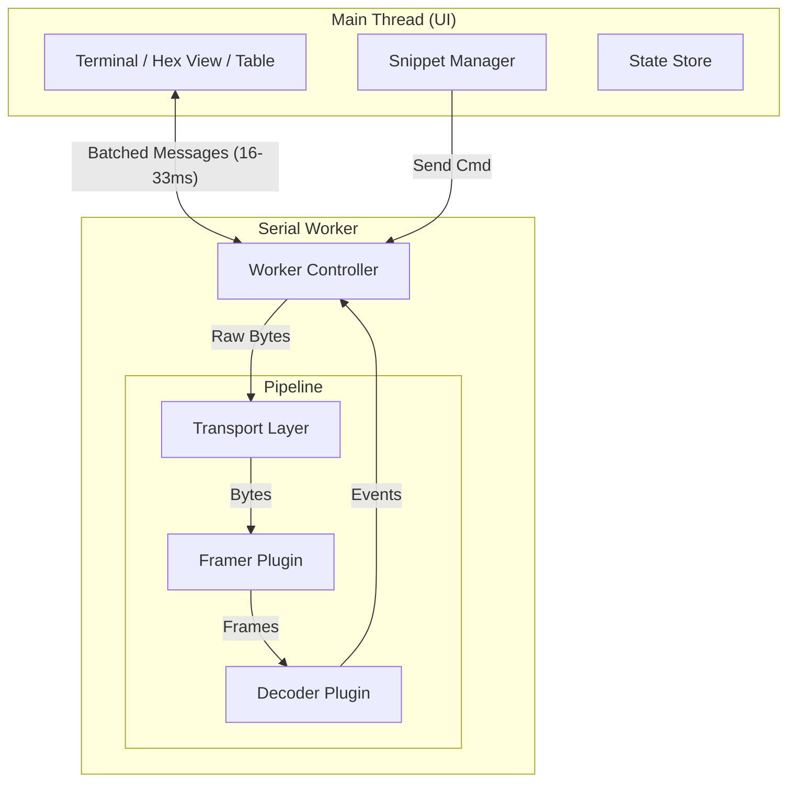

# SPEC-0001: Product + Architecture

> **Status**: DRAFT
> **Version**: 1.1

## 1. Overview
The goal is to build a "Swiss Army Knife" serial tool that serves two distinct worlds:
1.  **Raw Boot Console**: A fast, reliable, terminal-grade console for board bring-up.
2.  **Structured Protocol Analysis**: A flexible tool for decoding NMEA, MAVLink, and other protocols.

The tool is designed to be **Web-First** (running fully in Chromium-based browsers via Web Serial API) while maintaining a **Native** build option (Rust/Tauri) for environments without Web Serial support.

## 2. Goals
*   **Terminal-Grade Console**: Must support high-throughput text usage (ANSI codes, copy-paste, scrollback) suitable for Linux kernel logs, U-Boot, and RTOS consoles. Low-latency input handling is critical for shell "feel".
*   **Modular Decoding**: NMEA and MAVLink decoders are plugins that can be enabled/disabled at runtime.
*   **Productivity Tools**:
    *   **Quick Actions (Snippets)**: User-definable buttons for common commands (e.g., `reset`, `printenv`).
    *   **Hex Inspector**: "Hex + ASCII" view for debugging binary protocols or line noise.
*   **Web-First**: Zero-install experience. Open a URL, connect to a serial port, and start working.
*   **Native Parity**: The core logic (transport abstraction, framing, decoding) is shared Rust code.

## 3. Non-Goals (v1)
*   **Message Plotting**: Real-time graphing of numeric values (deferred to V1.5/V2).
*   **File Transfer**: XMODEM/YMODEM/Kermit for firmware upgrades (deferred to V2).
*   **"Spy/Sniffer" Mode**: We do not support monitoring an already-open port (requires OS-level drivers).
*   **Complex Scripting**: No Docklight-style trigger/response scripting engine in v1.
*   **Reliable Auto-Baud**: Fundamental limitations apply; heuristic only.

## 4. Constraints
*   **Baud Rate Required**: The Web Serial API strictly requires a baud rate to open a port.
*   **Stream-Based I/O**: Web Serial provides `ReadableStream` and `WritableStream`.
*   **Worker-Centric**: I/O, Framing, and Decoding **MUST** run in a dedicated Web Worker.
*   **Explicit Signals**: Control signals (DTR, RTS, Break) are set explicitly via API calls.

## 5. Architecture

The system is split into two runtimes: the **Main Thread (UI)** and the **Serial Worker**.

### 5.1 Data Flow
... (Unchanged from v1.0)
